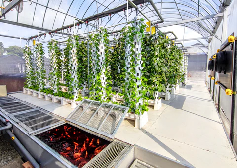
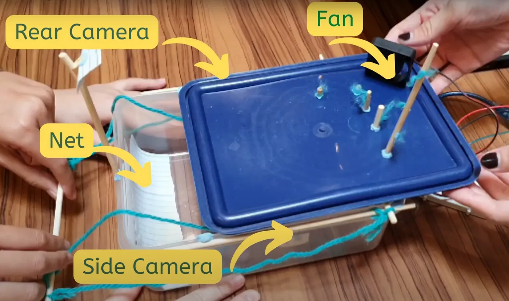
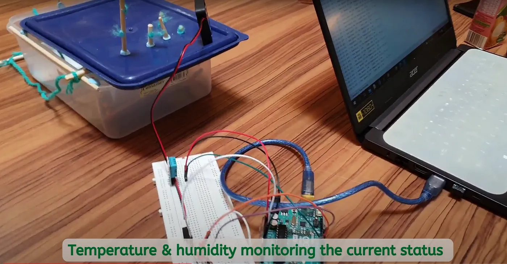
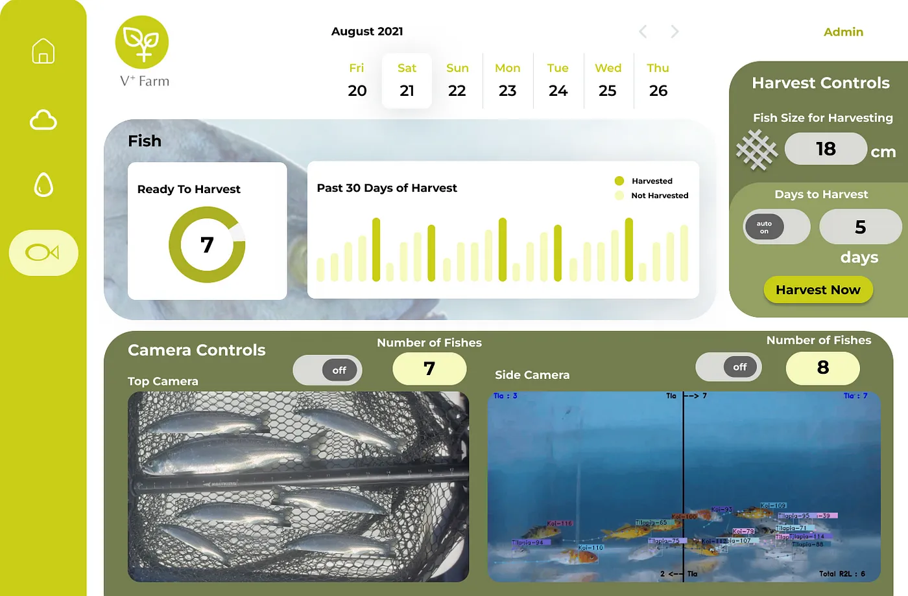
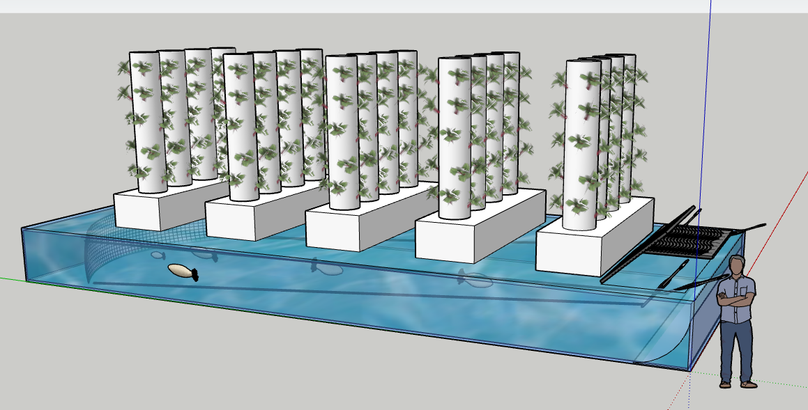

# **Dynamic Farm Project**

Dynamic farm combines technology of vertical farming and aquaculture under the water. This help to improve land usage and produce high quality and eco friendly products.

This project is to help dynamic farm monitoring fish population and maintain the conditions of the farm environment and the aquarium.

## **Tools used**

- **software** : ardiuno ide, figma

- **language** : c++

- **hardware** : arduino, temperature detector, ph detector, breadboard, wires, fan

## **Solutions**

- **Environment Monitoring**: Maintain the temperature Humidity of the farm system and the pH of the fish pond

    

    

- **Harvesting and Monitoring of Fish size**: Monitoring size of fish with computer vision and data analysis, minimal manual automated harvesting that is customized for dynamic farm

    

- **Dynamic Net**: A net that can dynamically change the size of its holes to adapt to different fish species

    